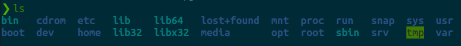
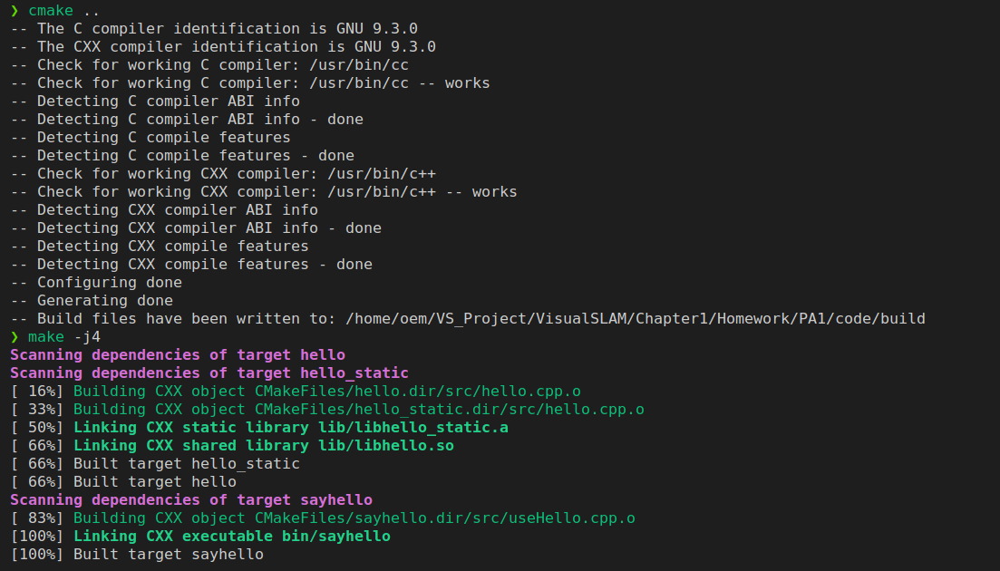
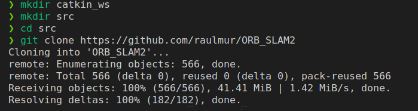
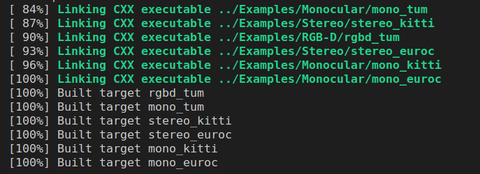
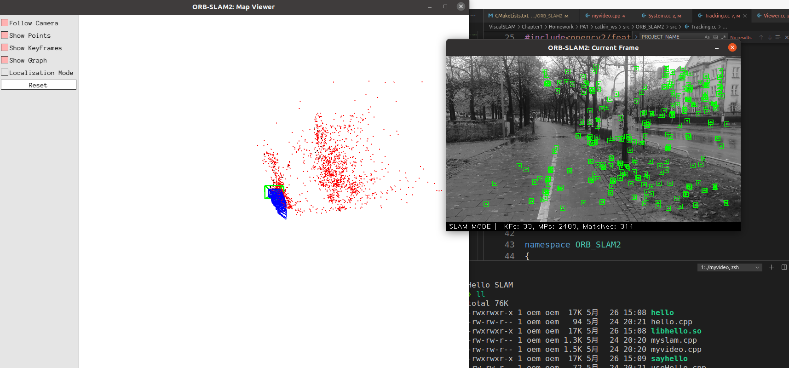

### 熟悉 Linux
1. 如何在 Ubuntu 中安装软件(命令行界面)?它们通常被安装在什么地方?
   通过源来安装: `sudo apt install *`
   通过deb包安装: `sudo dpkg -i *.deb`
   默认安装路径为/usr/share,可执行文件路径/usr/bin,lib文件路径/usr/lib
2. linux 的环境变量是什么?我如何定义新的环境变量?
   环境变量用来指定系统运行环境的一些参数。
   定义环境变量的方式：在终端中输入 `export 变量名=变量值`,也可以将其添加到/etc/profile或者~/.bashrc文件中去，区别是前者所有的用户设置系统范围的环境变量和启动顺序，当用户登录时读取该文件，这个文件对每个shell都有效；后者专属于个人bash shell的信息，当登录时以及每次打开一个新的shell时,执行这个文件，在这个文件里可以自定义用户专属的个人信息
3. linux 根目录下面的目录结构是什么样的?至少说出 3 个目录的用途
    
    1 \) /
    根目录: 每一个文件和目录都从这里开始。
    只有root用户具有该目录下的写权限。此目录和/root目录不同，/root目录是root用户的主目录。
    2\) /bin
    用户二进制文件: 包含二进制可执行文件。
    3) /etc
    配置文件: 包含所有程序所需的配置文件。
    4) /proc
    进程信息: 包含系统进程的相关信息
    5) /var
    变量文件: 这个目录下可以找到内容可能增长的文件。
    6) /home
    HOME目录: 所有用户用home目录来存储个人数据
4. 假设我要给 a.sh 加上可执行权限,该输入什么命令?
    `chmod +x a.sh` 根据需要加sudo
5. 假设我要将 a.sh 文件的所有者改成 xiang:xiang,该输入什么命令？
    `chown -R xiang:xiang a.sh` 根据需要加sudo
### SLAM 综述文献阅读
1. SLAM 会在哪些场合中用到?至少列举三个方向
    自动驾驶，扫地机器人，无人物流车，AR/VR
2. SLAM 中定位与建图是什么关系?为什么在定位的同时需要建图？
    SLAM的全称是同时定位与建图，其中定位是机器人知道自己在环境中的位置，建图是生成周围环境地图的过程。通常来讲，机器人从一个未知的地方开始移动，在自身的定位基础上进行增量式建图，实现自主导航功能。两者是相互依赖的关系，准确的定位需要精确的地图，精确的地图也来自于准确的定位。
3. SLAM 发展历史如何?我们可以将它划分成哪几个阶段?
    SLAM问题最先是由Smith Self 和Cheeseman 在1988年提出来的，被认为是实现真正全自主移动机器人的关键。早期卡尔曼滤波是SLAM的主流方法，包括KF，EKF，UKF，PF等，对解传感器信息进行最大似然估计；最近十多年来，图优化逐渐成为SLAM的主流方法，将BA引入到SLAM中，它不是迭代的过程，而是对历史信息做最小二乘，通过优化，将误差平均到每一次观测中，可以更直观的表达出优化问题。
    根据使用传感器的不同分为视觉、激光、惯性导航及融合导航。
4. 列举三篇在 SLAM 领域的经典文献
    1) 激光里程计 Planar Odometry from a Radial Laser Scanner. A Range Flow-based Approach
    2) cartographer Real-Time Loop Closure in 2D LIDAR SLAM
    3) lego-loam LeGO-LOAM: Lightweight and Ground-Optimized Lidar Odometry and Mapping on Variable Terrain
### CMake 练习
1. include/hello.h 和 src/hello.c构成了 libhello.so 库
2. 文件 useHello.c 中含有一个 main 函数,它可以编译成一个可执行文件,名为“sayhello”。
3. 默认用 Release 模式编译这个工程
4. 如果用户使用 sudo make install,那么将 hello.h 放至/usr/local/include/下,将 libhello.so 放至/usr/local/lib/下
    
  
### 理解 ORB-SLAM2 框架
1. 从 github.com 下载 ORB-SLAM2 的代码

2. 阅读 ORB-SLAM2 代码目录下的 CMakeLists.txt,回答问题：
    a) ORB-SLAM2 将编译出什么结果?有几个库文件和可执行文件?
    编译出的库有：ORB_SLAM2
    可执行文件有：rgbd_tum，stereo_
    kitti，stereo_euroc，mono_tum，mono_kitti，mono_euroc
    b) ORB-SLAM2 中的 include, src, Examples 三个文件夹中都含有什么内容?
    include中包括程序用到的头文件
    src中包括程序源文件
    examples中包括monocular，rgbd，ros，stereo文件夹，作为程序入口生成对应的可执行文件。
    c) ORB-SLAM2 中的可执行文件链接到了哪些库?它们的名字是什么?
    链接到了liborb_slam2.so库，liborb_slam2.so又链接到了libDBoW2.so，libg2o.so，opencv，eigen3，pangolin库
### 使用摄像头或视频运行 ORB-SLAM2
1. 为了实际运行 ORB-SLAM2,你需要安装它的依赖项,并通过它本身的编译

2. 如何将 myslam.cpp或 myvideo.cpp 加入到 ORB-SLAM2 工程中.
将myvideo拷贝过去并在cmake中添加可执行文件即可，需注意yaml和mp4文件路径
`add_executable(myvideo src/myvideo.cpp)`
`target_link_libraries(myvideo ${PROJECT_NAME}`  
3. 现在你的程序应该可以编译出结果了

运行中可以看到特征点的提取过程以及视觉里程计轨迹，但生成的特征点地图跟实际环境有点难对应起来
