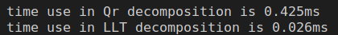
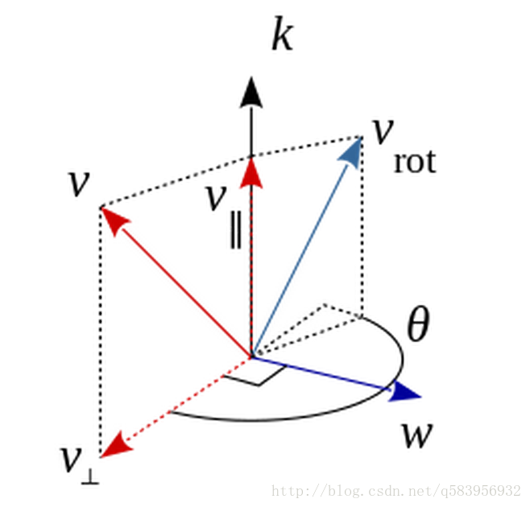

### 熟悉 Eigen 矩阵运算
设线性方程 Ax = b,在 A 为方阵的前提下,请回答以下问题:
1. 在什么条件下,x 有解且唯一?   
矩阵A满秩且秩等于增广矩阵，$det|A| \not ={0}$
2. 高斯消元法的原理是什么?
通过用初等行变换将增广矩阵化为行阶梯阵，然后通过回带求解线性方程组的解
3. QR 分解的原理是什么?
QR 分解是把矩阵分解成一个正交矩阵与一个上三角矩阵的积，常见的算法有Gram–Schmid正交化、Household变换，以及Givens变换。QR 分解经常用来解线性最小二乘法问题。
4. Cholesky 分解的原理是什么?
Cholesky 分解是把一个实对称正定的矩阵表示成一个下三角矩阵L和其转置的积。求解方程的过程变为：
    1)求解A的Cholesky分解，得到$A=LL^{T}$  
    2)求解$LY=B$,得到Y
    3)求解$L^{T}X=Y$,得到X
5. 编程实现 A 为 100 × 100 随机矩阵时,用 QR 和 Cholesky 分解求 x 的程序
   
   可以看出，LLT计算速度明显快于QR

### 几何运算练习
求该向量在小萝卜二号坐标系下的坐标
小萝卜1在地图下的坐标为$T_{W}^{c1}$, 小萝卜2在地图下的坐标为$T_{W}^{c2}$, 小萝卜1下的p1为$T_{p}^{c1}$
则在小萝卜2下的p1为$T_{p}^{c2} = T_{W}^{c2}* T_{p}^{W}=T_{W}^{c2} * (T_{c1}^{W})^{-1}* T_{p}^{c1}$


### 旋转的表达
1. 设有旋转矩阵 R,证明$R^{T}R=I$且$detR = ±1$  
   
由
$$R = \left[ \begin{matrix} e_{1}^{T} \\ e_{2}^{T} \\ e_{3}^{T} \end{matrix} \right]\left[ \begin{matrix} e_{1}^{'} & e_{2}^{'} & e_{3}^{'} \end{matrix} \right]$$

$$R^{T} = \left[ \begin{matrix} e_{1}^{'T} \\ e_{2}^{'T} \\ e_{3}^{'T} \end{matrix} \right]\left[ \begin{matrix} e_{1} & e_{2} & e_{3} \end{matrix} \right]$$
则
$$R^{T}R = \left[ \begin{matrix} e_{1}^{'T} \\ e_{2}^{'T} \\ e_{3}^{'T} \end{matrix} \right]\left[ \begin{matrix} e_{1} & e_{2} & e_{3} \end{matrix} \right]\left[ \begin{matrix} e_{1}^{T} \\ e_{2}^{T} \\ e_{3}^{T} \end{matrix} \right]\left[ \begin{matrix} e_{1}^{'} & e_{2}^{'} & e_{3}^{'} \end{matrix} \right]=I$$
$|I|=|RR^{T}|=|R||R^{T}|=|R|^{2},则det(R)=±1$

2. 设有四元数 q，我们把虚部记为 ε，实部记为 η，那么 q=(ε,η)。请说明 ε 和 η 的维度
   四元数 q 有三个虚部和一个实部,ε 维度为3，η维度为1
3. 请证明对任意单位四元数 q 1 , q 2 ,四元数乘法可写成矩阵乘法。

$$q_{1} = \left[\begin{matrix}\eta_{1} \\ \epsilon_{1}  \end{matrix}\right]$$
$$q_{2} = \left[\begin{matrix}\eta_{2} \\ \epsilon_{2}  \end{matrix}\right]$$
$$q_{1}q_{2} = \left[\begin{matrix}\eta_{1}\eta_{2} -\epsilon_{1}^{T} \epsilon_{2}   \\\eta_{1}\epsilon_{2}+ \eta_{2}\epsilon_{1} +\epsilon_{1}\times\epsilon_{2}\end{matrix}\right]$$

$$q_{1}^{+}q_{2} = \left[\begin{matrix}   \eta_{1} &-\epsilon_{1}^{T}\\\epsilon_{1} & \eta_{1}1+\epsilon_{1}^{\times}  \end{matrix}\right] \left[\begin{matrix}\eta_{2} \\ \epsilon_{2}  \end{matrix}\right] = \left[\begin{matrix} \eta_{1}\eta_{2}  -\epsilon_{1}^{T}\epsilon_{2}\\ (\eta_{1}1+\epsilon_{1}^{\times})\epsilon_{2} + \epsilon_{1}\eta_{2} \end{matrix}\right]=q_{1}q_{2}$$

同理可证$q_{1}q_{2}=q_{2}^{(+)}q_{1}$

### 罗德里格斯公式的证明
在三维空间中，旋转矩阵R RR可以对坐标系（基向量组）进行刚性的旋转变换，基向量组中的向量是相互正交的且都为单位向量，那么R就是一个标准正交矩阵。
假设原坐标系基向量矩阵为B，旋转后的坐标系基向量矩阵为C
$$B= \left[\begin{matrix}b_x & b_y & b_z \end{matrix}   \right]$$
$$C=RB=\left[\begin{matrix}r_{xx} & r_{xy} & r_{xz} \\r_{yx} & r_{yy} & r_{yz}\\r_{zx} & r_{zy} & r_{zz }\end{matrix}   \right]\left[\begin{matrix}b_x & b_y & b_z \end{matrix}   \right]$$
旋转矩阵R就是从基向量矩阵B到基向量矩阵C的过渡矩阵。由于旋转矩阵R是标准3阶正交矩阵，故旋转矩阵R的自由度为3,这说明最少可以用三个变量来表示旋转矩阵R.
罗德里格斯公式首先要确定一个三维的单位向量$k=\left[\begin{matrix}k_x & k_y & k_z \end{matrix}   \right]$,和一个标量$\theta$,共三个自由度

先考虑对一个向量作旋转，其中 v是原向量，三维的单位向量 $k=\left[\begin{matrix}k_x & k_y & k_z \end{matrix}   \right]$是旋转轴，$\theta$是旋转角度，$v_{rot}$是旋转后的向量。
先通过点积得到v在k方向的平行分量 
$$v_{||}=(vk)k$$
通过叉积得到v在k方向的正交分量
$$v_{⊥}=v-v_{||} = v-(vk)k=-k\times(k\times v)$$
$$\omega = k\times v$$
根据图可以看出
$$v_{rot}=v_{||}+cos(\theta)v_{⊥}+sin(\theta)\omega$$
K的反对称矩阵为
$$K=\left[\begin{matrix} 0 & -k_z & k_y \\ k_{z} & 0 & -k_{x} \\ -k_{y} & k_{x} & 0\end{matrix} \right] $$
$$k\times v = Kv$$
得到
$$v_{rot}=cos(\theta)v+k \times (k\times v) - cos(\theta)k \times (k\times v) + sin(\theta)(k\times v) $$
根据叉积的性质，得到
$$v_{rot}=cos(\theta)v+(1- cos(\theta))K^{2}v  + sin(\theta)(Kv) $$
$$v_{rot}=(cos(\theta)I+(1- cos(\theta))K^{2}v  + sin(\theta)K)v $$
将v替换为B和C,R，得到罗德里格斯公式
$$R = cos(\theta)I+(1- cos(\theta))K^{2}+ sin(\theta)K$$


### 四元数运算性质的验证
课程中介绍了单位四元数可以表达旋转。其中,在谈论用四元数 q 旋转点 p 时,结果为
$$p^{'}=qpq^{-1}$$
此时 p ′ 必定为虚四元数(实部为零)。请你验证上述说法.上式亦可写成矩阵运算:p ′ = Qp。请根据你的推导,给出矩阵 Q。
可以使用第4题结果，
$$p^{'}=q^{+}q^{-1(+)}p$$
证明：
设 
$$q = \left[\begin{matrix}\epsilon \\ \eta  \end{matrix}\right],q^{-1} = \left[\begin{matrix}-\epsilon \\ \eta  \end{matrix}\right]$$
令
$$p = \left[\begin{matrix}r_{b} \\ 0  \end{matrix}\right],p^{-1} = \left[\begin{matrix}r_{b}^{'} \\ 0  \end{matrix}\right]$$
则
$$p^{'}=q^{+}q^{-1(+)}p= \left[\begin{matrix}\eta I +\epsilon^{\times} & \epsilon \\ -\epsilon^{T} & \eta \end{matrix}\right]\left[\begin{matrix}\eta I -\epsilon^{\times} & \epsilon \\ -\epsilon^{T} & \eta \end{matrix}\right] \left[\begin{matrix}r_{b} \\ 0  \end{matrix}\right]
= \left[\begin{matrix}-(\eta I -\epsilon^{\times})^{2} & 0 \\ 0 & -1 \end{matrix}\right] \left[\begin{matrix}r_{b} \\ 0  \end{matrix}\right] $$
可得
$$r_{b}^{'}=(-(\eta I-\epsilon^{\times})^{2}-\epsilon\epsilon^{T})r_{b}$$
$$R=-(\eta I-\epsilon^{\times})^{2}-\epsilon\epsilon^{T}$$

### 熟悉 C++11
设有类 A,并有 A 类的一组对象,组成了一个 vector。现在希望对这个 vector 进行排序,但排序的方式由 A.index 成员大小定义。那么,在 C++11 的语法下,程序写成
```
#include <iostream>
#include <vector>
#include <algorithm>

using namespace std;

class A {
public:
A(const int& i ) : index(i) {}
int index = 0;
};

int main() {
A a1(3), a2(5), a3(9);
vector<A> avec{a1, a2, a3};
std::sort(avec.begin(), avec.end(), [](const A&a1, const A&a2) {return a1.index<a2.index;});
for ( auto& a: avec ) cout<<a.index<<" ";
cout<<endl;
return 0;
}
```
1. for循环中使用auto遍历，作为vector里面成员的引用
2. 使用了lambda表达式
3. 在类定义中初始化非静态成员
4. vector初始化向量{a1,a2,a3}